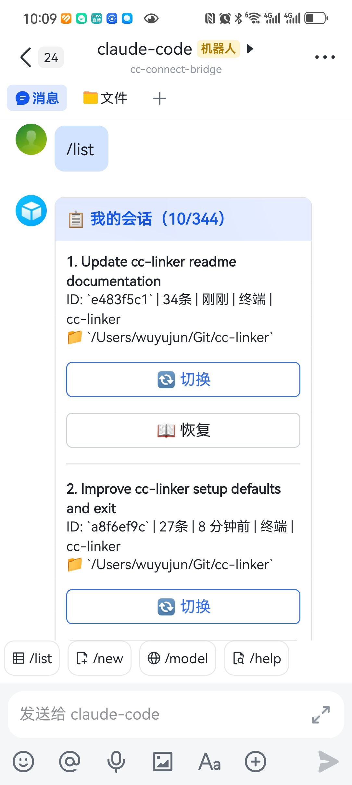
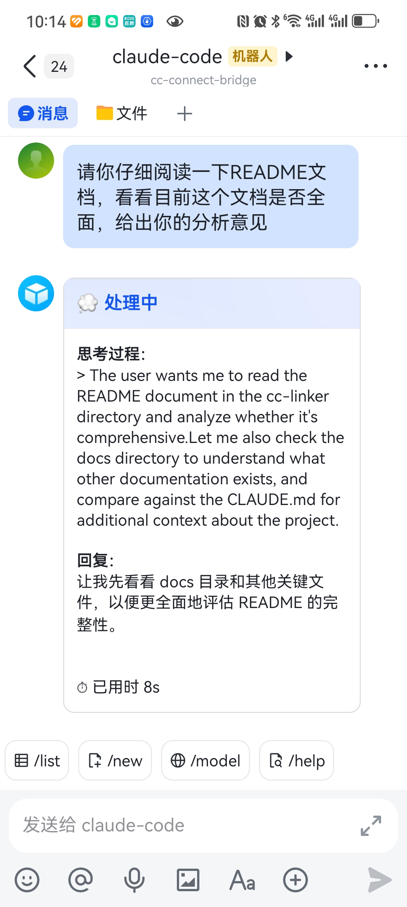
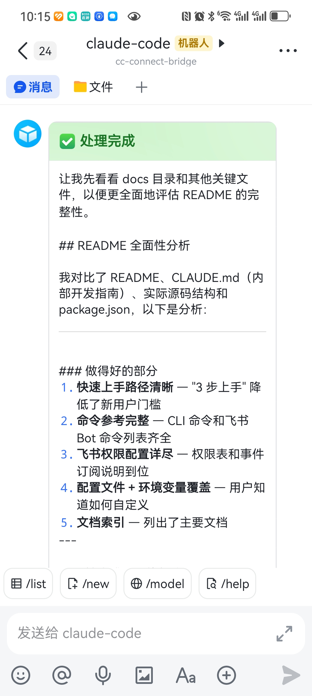
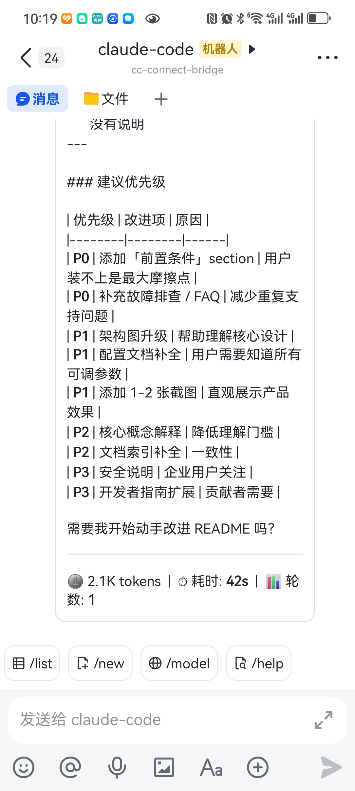
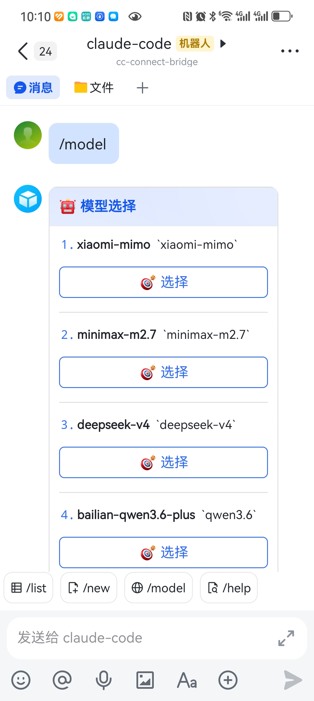
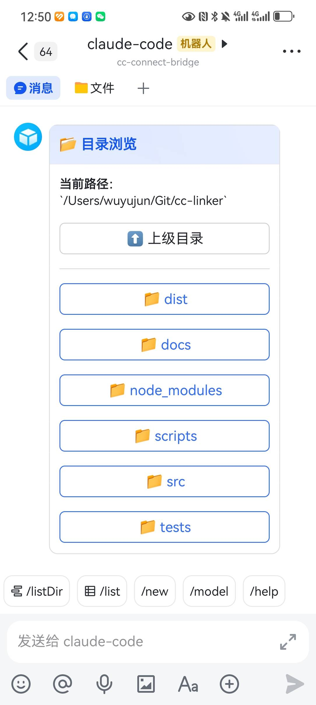
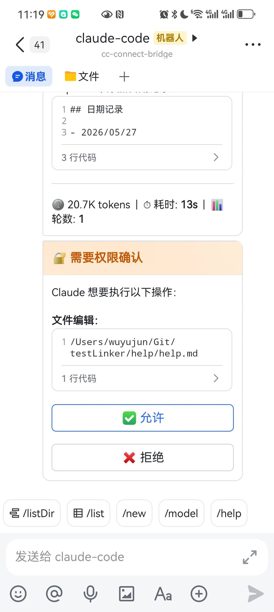
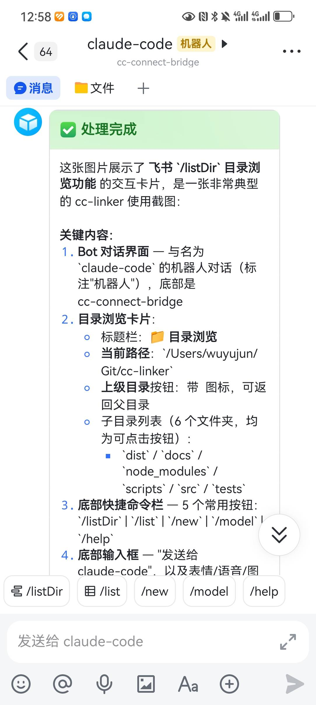
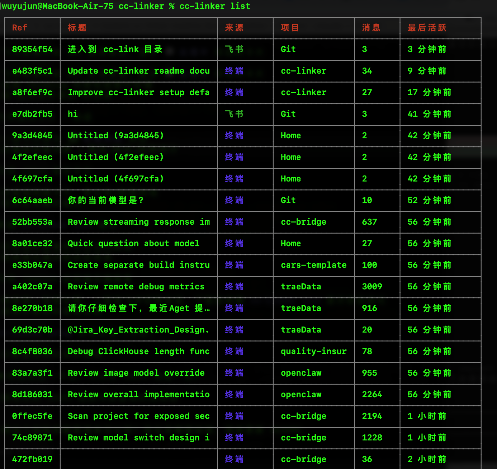
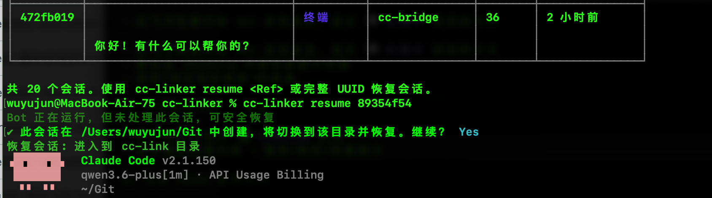

# cc-linker

> 让手机聊天应用和终端（Claude Code CLI）之间的对话切换，像切换设备一样无缝。
>
> **目前已接入飞书**，更多聊天平台持续扩展中。

[](https://www.npmjs.com/package/cc-linker)
[](LICENSE)

**语言:** 中文 | [English](README_en.md)

## 💡 为什么需要 cc-linker？

你是否遇到过这样的场景：

- **通勤路上用手机聊，到公司终端继续** — 地铁上用手机飞书给 Bot 发消息讨论技术方案，到公司打开终端 `cc-linker list` 找到会话，`resume` 一键恢复上下文
- **飞书快速提问，终端深度调试** — 在飞书里快速问了个 API 用法，发现需要本地调试，终端 `cc-linker resume` 切换到同一会话继续让 Claude 帮你写代码
- **多项目并行，会话不乱** — 同时在 `project-a` 和 `project-b` 两个目录与 Claude 对话，`/list` 清晰展示每个会话的目录和状态，卡片按钮一键切换不混淆

**cc-linker 就是解决这些痛点的桥接工具。** 它在你电脑上维护一个统一的会话注册表，让手机聊天应用和 Claude Code CLI 共享同一套会话状态——无论你在哪个端发起对话，都能无缝切换到另一端继续。

> **当前已接入飞书**，更多聊天平台持续扩展中。

## ✨ 核心特性

| 特性 | 说明 |
|------|------|
| 🔄 **跨端无缝切换** | 聊天应用发起的对话，终端一键恢复（含上下文和目录）；终端创建的会话，聊天应用随时查看 |
| 💬 **流式卡片交互** | 聊天应用中实时看到 Claude 的 thinking 和回复，不再是"转圈等待" |
| 🛡 **交互式权限确认** | SDK 模式下 Claude 需要执行工具时，飞书卡片弹出允许/拒绝按钮 |
| 🖼 **图片消息支持** | 飞书发送的图片自动下载并传递给 Claude 分析 |
| 📂 **目录浏览** | `/listDir` 命令交互式浏览和切换工作目录 |
| 📋 **统一会话管理** | 自动扫描、增量同步，无需手动维护会话列表 |
| 🎛 **多模型切换** | 在卡片中一键切换模型，无需改配置 |
| 💾 **持久化不丢消息** | 文件级消息队列，进程崩溃、重启后消息不丢失 |
| 🚀 **3 步上手** | `install → setup → start`，5 分钟完成配置 |

## 📸 效果展示

### 聊天应用端体验（飞书）

> 当前已支持飞书，更多平台开发中。

<table>
  <tr>
    <td align="center"><b>会话列表</b><br><code>/list</code> 查看所有会话</td>
    <td align="center"><b>开始处理</b><br>消息发出后即时反馈</td>
    <td align="center"><b>流式实时反馈</b><br>实时看到 thinking 过程</td>
  </tr>
  <tr>
    <td align="center"></td>
    <td align="center"></td>
    <td align="center"></td>
  </tr>
</table>

<table>
  <tr>
    <td align="center"><b>处理完成</b><br>token / 耗时 / 轮数统计</td>
    <td align="center"><b>处理完成（长回复）</b><br>长文本同样展示</td>
    <td align="center"><b>模型切换</b><br>卡片按钮一键切换</td>
  </tr>
  <tr>
    <td align="center"></td>
    <td align="center"></td>
    <td align="center"></td>
  </tr>
</table>

<table>
  <tr>
    <td align="center"><b>目录浏览</b><br><code>/listDir</code> 交互式浏览文件系统</td>
    <td align="center"><b>SDK 权限确认</b><br>交互式允许/拒绝 Claude 的工具调用</td>
    <td align="center"><b>图片消息</b><br>飞书发送图片，Claude 自动分析</td>
  </tr>
  <tr>
    <td align="center"></td>
    <td align="center"></td>
    <td align="center"></td>
  </tr>
</table>

### 终端端体验

**查看所有会话** — 清晰的表格展示，状态一目了然：



**一键恢复会话** — 支持前缀匹配，自动切换目录并恢复上下文：



## 🚀 快速开始

### 1. 安装

**前置要求**：`Bun >= 1.0`（必需运行时）。如果通过 `npm install -g` 安装，还需要 `Node.js >= 20` 提供 `npm`。

```bash
# 方式 1：通过 npm 全局安装
# 安装时需要 Node.js/npm，运行 cc-linker 仍需要 Bun 运行时
npm install -g cc-linker@latest

# 方式 2：通过 Bun 全局安装
bun add -g cc-linker

# 安装 Bun:
# curl -fsSL https://bun.sh/install | bash
```

> **说明**：当前 npm 包入口基于 Bun 构建；如果希望完全不依赖 Bun，请使用仓库构建出的独立二进制版本。
>
> **更新提示**：`npm install -g cc-linker@latest` 时，如果 daemon 正在运行，会自动调用 `cc-linker restart` 升级到新版，无需手动重启。

### 2. 一键配置

```bash
cc-linker setup
```

交互式向导会引导你完成：
- 初始化会话注册表
- 安装 Claude Code 自动注册钩子
- 配置聊天应用 Bot（当前仅飞书：App ID + App Secret + 开机自启）

> **仅需终端侧功能？** 运行 `cc-linker setup --skip-feishu` 跳过聊天应用配置。

### 3. 开始使用

| 场景 | 操作 |
|------|------|
| 聊天应用中给 Bot 发消息（飞书） | 直接对话，流式卡片实时更新 |
| 终端查看所有会话 | `cc-linker list` |
| 终端恢复某个会话 | `cc-linker resume <UUID>` |
| 聊天应用切换会话（飞书） | `/switch <序号\|UUID>` |
| 聊天应用选择新会话目录（飞书） | `/listDir` 浏览目录，为下一条消息选择新会话目录 |
| 聊天应用创建新会话（飞书） | `/new [路径] [--model <别名>] [-- 提示词]` |

## 📋 命令参考

### CLI 命令

```bash
cc-linker list                      # 列出所有会话
cc-linker resume <UUID>             # 恢复指定会话到终端（支持前缀匹配）
cc-linker show <UUID>               # 查看会话详情
cc-linker sync                      # 手动同步两端会话
cc-linker search <关键词>           # 搜索会话
cc-linker export <UUID>             # 导出会话为 Markdown/JSON/Text
cc-linker clean                     # 清理无效记录
cc-linker status                    # 查看桥接状态
```

### 聊天应用 Bot 命令（飞书）

在飞书私聊中给 Bot 发送：

| 命令 | 说明 |
|------|------|
| `/help` | 显示帮助 |
| `/list` | 列出会话（带切换/恢复按钮卡片） |
| `/listDir` | 浏览目录，并为下一条消息选择新会话目录 |
| `/new [路径] [--model <别名>] [-- 提示词]` | 立即创建新会话，或只预设新会话目录/模型 |
| `/switch <序号\|UUID>` | 切换会话 |
| `/resume <序号\|UUID>` | 获取终端恢复命令 |
| `/model [序号\|别名\|--clear]` | 查看、设置或清除默认模型 |
| `/status` | 查看状态 |
| `/whoami` | 获取你的 open_id |

> **说明 1**：`/switch` 和 `/resume` 中的数字序号来自最近一次 `/list` 生成的列表快照，默认 10 分钟内有效；超时后请重新执行 `/list`。
>
> **说明 2**：`/new` 支持“先选目录/模型，后发第一条消息再真正创建会话”的用法；`/model` 设置的是当前用户的默认模型，直到 `/model --clear` 清除。

### Bot 运行管理

| 命令 | 说明 |
|------|------|
| `cc-linker start` | 前台启动（阻塞终端） |
| `cc-linker start --daemon` | 后台守护进程模式 |
| `cc-linker stop` | 停止后台 Bot |
| `cc-linker restart` | 重启 Bot 服务 |
| `cc-linker daemon install` | 配置开机自动启动 |
| `cc-linker daemon uninstall` | 移除开机自启 |
| `cc-linker daemon status` | 查看后台服务状态 |

## 🔧 接入飞书（第一个支持的聊天平台）

cc-linker 的架构设计支持接入多种聊天应用，**飞书是第一个已实现的平台**。后续可扩展支持其他 IM 平台。

在配置飞书 Bot 前，需要在 [飞书开放平台](https://open.feishu.cn/app) 创建应用并配置权限。

### 创建应用

1. 访问 https://open.feishu.cn/app → 创建企业自建应用
2. 在「应用功能」→「机器人」中启用 Bot 能力
3. 获取 App ID 和 App Secret（凭证与基础信息）

### 必需权限

进入「权限管理」，搜索并开通以下权限：

| 权限 | 用途 |
|------|------|
| `im:message` | 读取和发送消息 |
| `im:message:send_as_bot` | 以应用身份发送消息 |
| `im:message:readonly` | 获取消息详情 |
| `im:resource` | 下载用户发送的图片资源 |
| `im:chat:readonly` | 获取群组信息 |
| `contact:user.base:readonly` | 获取用户基本信息 |

### 必需事件订阅

进入「事件与回调」，按以下两个位置分别添加：

**事件配置**：

| 事件 | 用途 |
|------|------|
| `im.message.receive_v1` | 接收用户发给 Bot 的消息 |
| `im.chat.member.bot.added_v1` | Bot 被邀请进群时触发（可选） |

**回调配置**：

| 回调 | 用途 |
|------|------|
| `card.action.trigger` | 接收卡片按钮点击（`/list` 切换会话、模型切换、SDK 权限确认等交互） |

> **重要**：订阅方式选择 **WebSocket**（不是 HTTP 回调）。
>
> **说明**：`card.action.trigger` 是卡片交互的基础，不添加会导致 `/list`、`/model`、SDK 权限确认等所有卡片按钮点击无响应。

### 发布应用

配置完权限后，进入「版本管理与发布」→ 创建版本 → 发布。**只有发布后的权限才会生效。**

## 📖 配置说明

配置文件：`~/.cc-linker/config.toml`（可选，不创建则使用默认值）

```toml
[general]
log_level = "info"
claude_bin = "claude"

[feishu_bot]
# owner_open_id = "ou_xxx"
# default_cwd = "/path/to/workspace"

[stream]
enabled = true
throttle_ms = 1500
show_thinking = true
max_card_bytes = 25000
fallback_to_text = true

[claude]
# 权限模式：控制 Claude Code 执行操作时的交互确认行为
# 由于飞书端无法完成终端式交互确认，默认自动接受文件编辑
# 可选值：acceptEdits / auto / bypassPermissions / default / dontAsk / plan
permission_mode = "acceptEdits"

# 工具白名单（可选）：显式允许的工具列表
# 默认空数组，表示遵从 Claude Code 本地设置（~/.claude/settings.json）
# 若配置此项，会覆盖本地设置。示例：["Read", "Edit", "Bash(git *)"]
# allowed_tools = []

# 工具黑名单（可选）：显式禁止的工具列表
# 默认空数组，表示遵从 Claude Code 本地设置
# 若配置此项，会覆盖本地设置。示例：["Bash", "Write"]
# disallowed_tools = []

[sdk]
# Agent SDK 模式（支持飞书卡片上的交互式权限确认）
# 默认开启。如需关闭，设为 false
# enabled = true               # 默认 true，支持飞书端交互式权限确认
# permission_mode = "acceptEdits"  # SDK 基础权限模式
# timeout_ms = 600000          # 权限确认超时（10分钟）
# claude_executable = "claude" # Claude 可执行文件路径

[images]
# 图片消息处理（默认开启）
# enabled = true               # 默认 true，自动下载飞书图片并传递给 Claude
# max_size_bytes = 10485760    # 图片大小限制（默认 10MB）
# cleanup_max_age_hours = 24   # 过期图片清理周期（默认 24 小时）
```

**注意：** SDK 模式需要系统已安装 `claude` 命令行工具（`npm install -g @anthropic-ai/claude-code`）。如需自定义可执行文件路径，可使用 `general.claude_bin` 或 `sdk.claude_executable`。

**补充：** SDK 权限确认卡片如果发送失败，或用户在超时时间内未确认，当前实现会自动拒绝该次工具调用。

**环境变量覆盖**：

| 环境变量 | 说明 |
|---------|------|
| `CC_LINKER_DIR` | 覆盖 cc-linker 数据目录（默认 `~/.cc-linker`） |
| `CC_LINKER_CONFIG_PATH` | 指定配置文件路径 |
| `CC_LINKER_REGISTRY_PATH` | 指定 registry 文件路径 |
| `CC_LINKER_LOG_PATH` | 指定日志文件路径 |
| `CC_LINKER_FEISHU_APP_ID` | 飞书 App ID |
| `CC_LINKER_FEISHU_APP_SECRET` | 飞书 App Secret |
| `CC_LINKER_FEISHU_OWNER_OPEN_ID` | 限制仅指定用户使用 |
| `CC_LINKER_FEISHU_DEFAULT_CWD` | 默认工作目录 |
| `CC_LINKER_STREAM_ENABLED` | 流式响应开关 |
| `CC_LINKER_LOG_LEVEL` | 日志级别 |
| `CC_LINKER_CLAUDE_PERMISSION_MODE` | Claude Code 权限模式 |
| `CC_LINKER_CLAUDE_ALLOWED_TOOLS` | 允许的工具列表（逗号分隔） |
| `CC_LINKER_CLAUDE_DISALLOWED_TOOLS` | 禁止的工具列表（逗号分隔） |
| `CC_LINKER_SDK_ENABLED` | 启用 Agent SDK 模式（true/false，默认 true） |
| `CC_LINKER_SDK_PERMISSION_MODE` | SDK 权限模式 |
| `CC_LINKER_SDK_TIMEOUT_MS` | 权限确认超时（毫秒） |
| `CC_LINKER_SDK_CLAUDE_EXECUTABLE` | Claude 可执行文件路径 |
| `CC_LINKER_MAX_CONCURRENT_SESSIONS` | 最大并发会话数（默认 5） |
| `CC_LINKER_SESSION_LOCK_TIMEOUT_MS` | 单个会话锁超时（毫秒） |
| `CC_LINKER_MAX_QUEUE_SIZE` | 消息队列最大积压数量 |
| `CC_LINKER_CONFIRM_RISKY_ACTIONS` | 是否确认高风险操作（true/false） |
| `CC_LINKER_IMAGES_ENABLED` | 图片处理开关（默认 true） |
| `CC_LINKER_IMAGES_MAX_SIZE` | 图片大小限制（字节） |
| `CC_LINKER_IMAGES_CLEANUP_HOURS` | 图片清理周期（小时） |

## 🏗 架构概览

```
┌──────────────────────────────────────────────────────┐
│  Claude Code CLI    ←→  Registry  ←→  聊天应用 Bot    │
│  (session JSONL)    (registry.json)  (当前: 飞书)     │
│                          ↑                           │
│                   SessionStart hook                  │
│                                                      │
│  内置模块：                                           │
│  - SDK 模式 (默认): Agent SDK + 交互式权限确认        │
│  - 流式模式: stream-json + 卡片实时更新               │
│  - 图片处理: 自动下载 + prompt 注入                   │
│  - 目录浏览: /listDir 交互式切换 cwd                  │
│  - 文件队列: 消息持久化 + 崩溃恢复                    │
└──────────────────────────────────────────────────────┘
```

- **Registry** (`~/.cc-linker/registry.json`): 统一会话索引，带文件锁和自动备份
- **User Mapping** (`~/.cc-linker/user-mapping.json`): 飞书用户 open_id → 当前会话目标的映射（CAS 原子更新）
- **Scanner**: 增量扫描 Claude Code JSONL 文件，保持注册表最新
- **Hook**: Claude Code 启动时自动注册新会话
- **Spool Queue**: 持久化消息队列，崩溃后可恢复（pending → processing → replied → done/failed）
- **Stream Parser**: 解析 Claude `stream-json` 输出
- **Card Updater**: 流式卡片 + 权限卡片的发送与节流
- **Permission Handler**: SDK 模式下工具权限的交互式确认（允许/拒绝/超时自动拒绝）
- **Image Processor**: 飞书图片下载、prompt 注入、过期清理
- **Startup Reconciler**: 进程启动时自动修复不一致状态（恢复卡住的消息、回滚超时 claim、补齐 jsonl_path）

详细架构见 [docs/产品设计文档-自建方案.md](docs/产品设计文档-自建方案.md)。

## 💻 开发者指南

```bash
git clone https://github.com/yujuntea/cc-linker.git
cd cc-linker
bun install
bun run dev <命令>        # 开发模式
bun run typecheck         # 类型检查
bun test                  # 运行测试
bun test --coverage       # 带覆盖率
```

### 两种构建产物

cc-linker 支持两种分发形式，构建脚本不同：

| 产物 | 构建命令 | 输出 | 用途 |
|------|----------|------|------|
| **独立二进制** | `bun run build` | `dist/cc-linker` | 单机使用，无需额外运行时 |
| **npm 包** | `bun run build:npm` | `dist/cli.js` | `npm install -g` 全局安装（运行时仍需 Bun） |

### npm 包本地测试

正式发布前，建议先在本地打包安装验证，确保 `files` 字段和 `bin` 入口正确。

**方法 1：pack + install（最接近真实发布）**

```bash
# 1. 构建并打包
bun run build:npm         # 生成 dist/cli.js
npm pack                  # → cc-linker-x.y.z.tgz

# 2. 在干净环境安装测试
mkdir -p /tmp/test-cc-linker && cd /tmp/test-cc-linker
npm install /path/to/cc-linker-0.2.0.tgz
npx cc-linker --version   # 验证命令可用
cc-linker list            # 验证功能正常

# 3. 特别验证 daemon install 生成的 plist/service 中可执行路径正确
cc-linker daemon install  # 检查生成的配置文件中 ProgramArguments/ExecStart
```

**方法 2：bun link（开发迭代最快）**

```bash
# 创建全局符号链接，修改代码后重新 build:npm 立即生效
bun run build:npm
bun link                  # 或 npm link

# 全局任意位置测试
cc-linker list
cc-linker daemon install

# 解除链接
bun unlink cc-linker
```

> ⚠️ `bun link` 是符号链接到源码目录，不经过 `files` 字段过滤。发布前**务必用方法 1 验证一次**，避免 `files` 遗漏必要文件。

### 发布

```bash
# 独立二进制（本地分发）
bun run build             # → dist/cc-linker

# npm 发布
npm version minor         # 或 patch / major
npm publish               # prepublishOnly 自动触发 build:npm
git push --tags
```

## 📚 详细文档

| 文档 | 说明 |
|------|------|
| [docs/产品设计文档-自建方案.md](docs/产品设计文档-自建方案.md) | 产品设计文档 |
| [docs/验收指南.md](docs/验收指南.md) | 功能验收指南 |
| [docs/验收测试报告.md](docs/验收测试报告.md) | 验收测试结果 |
| [docs/Product.md](docs/Product.md) | 产品需求文档 |
| [docs/model-switch-design.md](docs/model-switch-design.md) | 模型切换设计 |

## License

MIT
